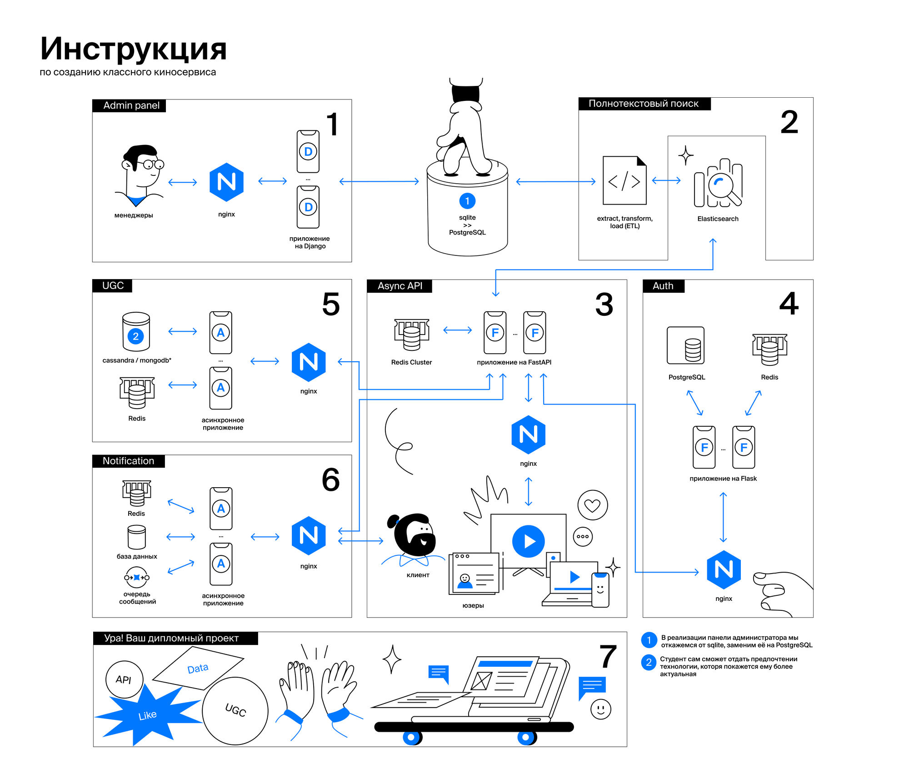

# Yanflix
Результат обучения на курсе Мидл python-developer в Яндекс Практикуме

Yanflix - онлайн кинотеатр с микросервисной архитектурой, реализованы следующие сервисы: Auth, Billing, Notification, UGC, Async API, Admin Panel, ETL.

 - Billing сервис(FastAPI: Дипломный проект) - https://github.com/Rusich90/graduate_work
 - Auth сервис(Flask, Oauth) - https://github.com/Rusich90/Auth_sprint_1-1
 - Notification сервис(RabbitMQ, SMTP, Workers) - https://github.com/Rusich90/notifications_sprint_1
 - Async API(FastAPI) (основной сервис для доступа юзеров к фильмам) - https://github.com/Rusich90/Async_API_sprint_4
 - UGC сервис(Kafka, ClickHouse) - https://github.com/Rusich90/ugc_sprint_1-1
 - ETL сервис (из постгреса в эластик) - https://github.com/Rusich90/ETL
 - Admin Panel (Django) - https://github.com/Rusich90/Admin_panel_sprint_2
